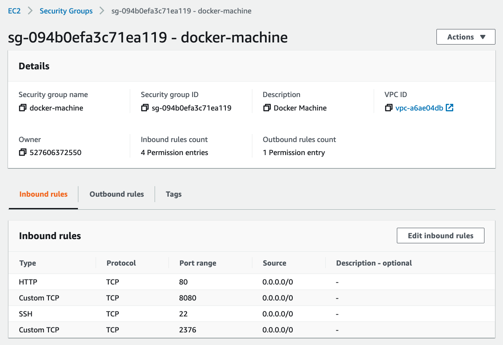
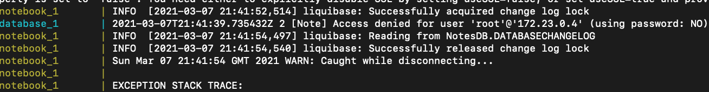

# EX07-Docker
- docker介紹 https://www.docker.com/resources/what-container
- docker machine介紹 https://docs.docker.com/machine/
	- Docker Machine is a tool that lets you install Docker Engine on virtual hosts


## Task-1
docker-machine要另外裝！！！！ https://docs.docker.com/machine/install-machine/


``` 
docker-machine create --driver amazonec2 --amazonec2-region us-east-1 awsmachine
```

make sure credential is set


```
docker-machine env awsmachine

eval $(docker-machine env awsmachine)
```

這個時候docker cli已經是遠端到awsmachine的docker
執行遠端的hello-world image

```
docker run hello-world
```

# Task-2

docker Compose已經裝好在docker desktop裡面了


# Task-3

port 8080 for administator

# Task-4

start local notebook app
```
docker build -t my-nba-image .

# port mapping
docker run -d -p 8080:80 --name nb1 my-nba-image
```
Need to edit EC2 instance security for port 80 and 8081
Access to nodebook on EC2 instance-ip:8080 should be successful

creating internal network among containers
```
docker network create -d bridge net1
```

start notebook app + text processor
```
docker run -d --name tp2 --net=net1 my-tp-image

docker run -d --name nb2 --net=net1 -e TPMODE=remoteSingle -e TPURL=http://tp2:80/api -p 8080:80 my-nba-image
```

直接用手動run nba, tp, 跟mysql database看來會跑不起來, 從docker-compose看得出來似乎是mysql沒有順利登入

```
docker run -d --name tp3 --net=net1 my-tp-image
docker run -d --name mysql3 --net=net1 -e MYSQL_ROOT_PASSWORD=secret -e MYSQL_DATABASE=NotesDB mysql:5.7
docker run -d --name nb3 --net=net1 -e TPMODE=remoteSingle -e TPURL=http://tp3:80/api -e DBMODE=jdbc -e DBURL=jdbc:mysql://mysql3:3306/NotesDB -e DBUSER=root -e DBPASS=secret -p 8080:80 my-nba-image


```

```
docker tag a9d6138c548a kuangyu0801/text-processor-service:v1

docker push kuangyu0801/text-processor-service:v1 

docker tag cbeed6dee953 kuangyu0801/notebookapp:v1

docker push kuangyu0801/notebookapp:v1

```
# Task-5

